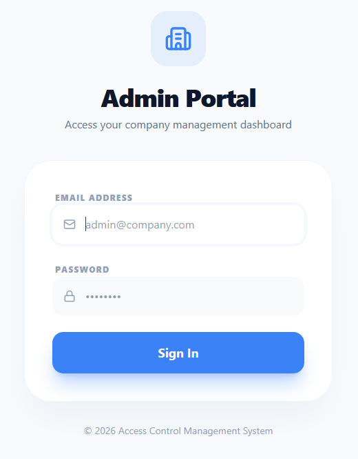
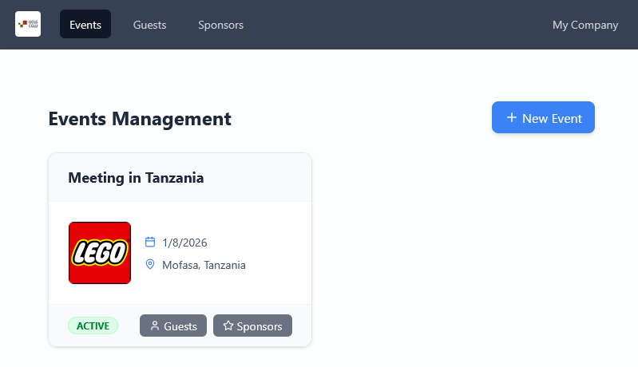
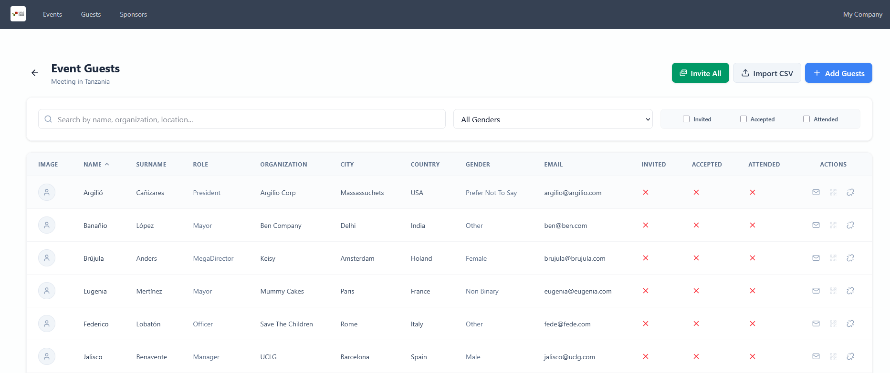
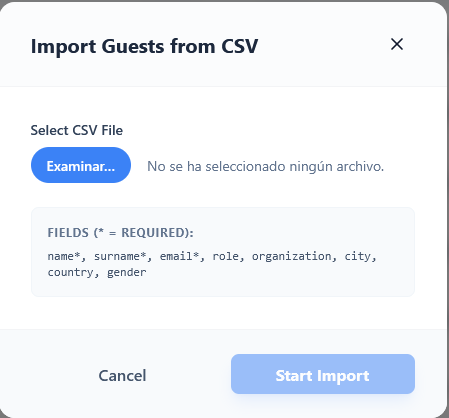
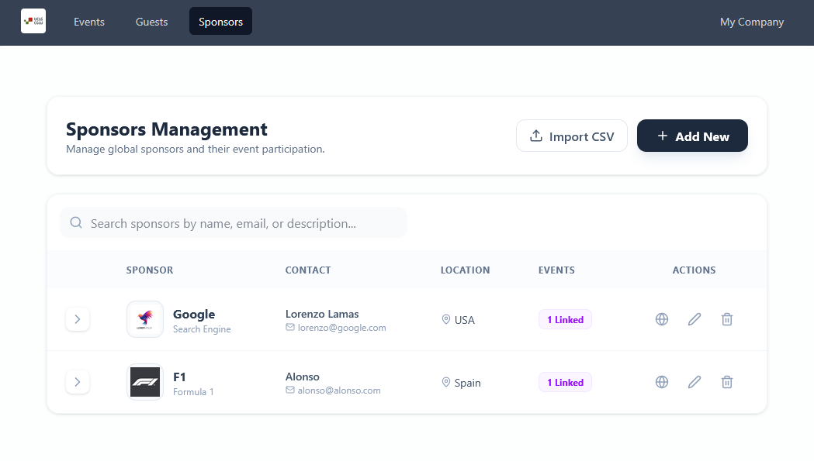
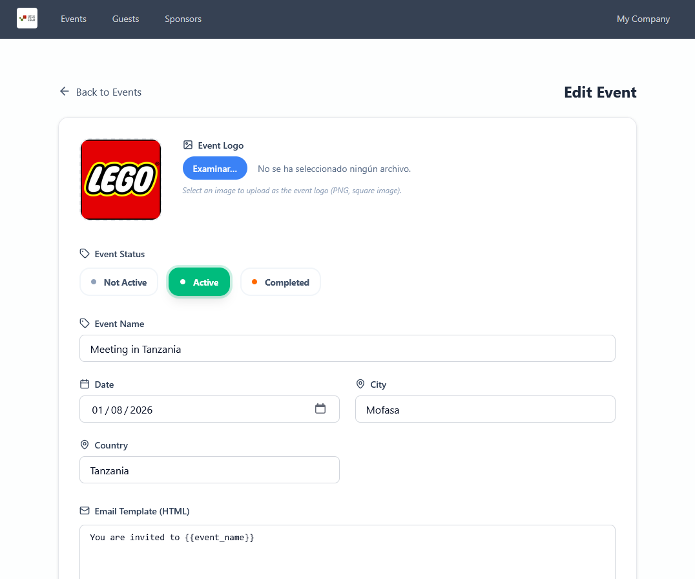
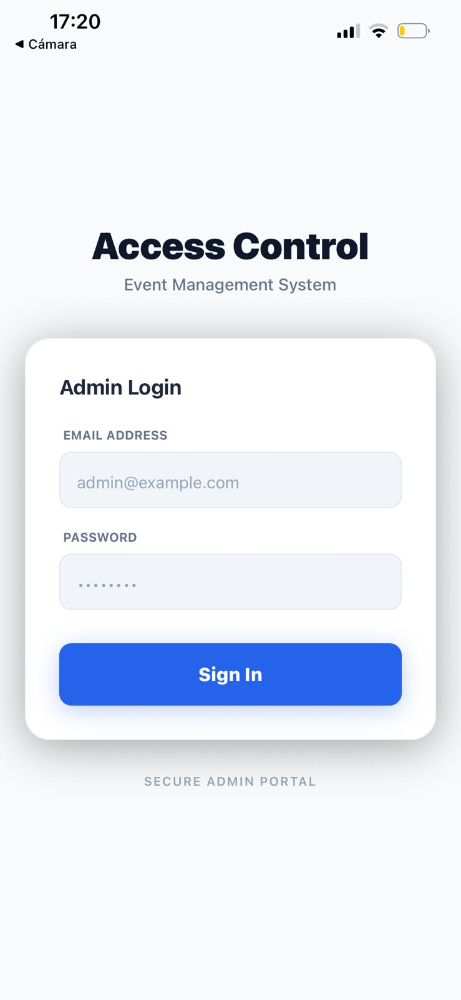
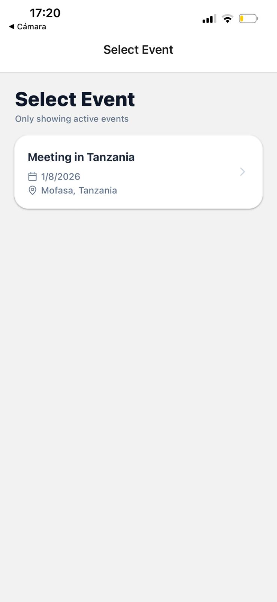
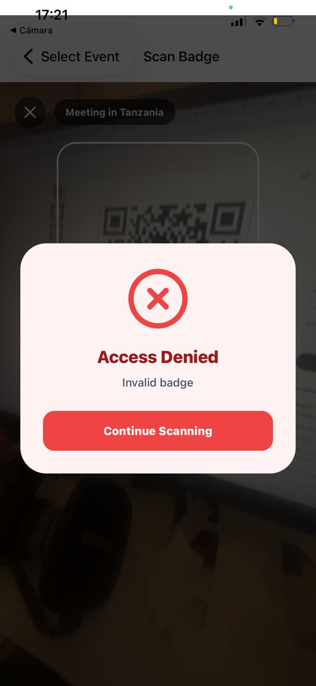

# Access Control & Event Attendance System

This project is a comprehensive event management and access control system designed to handle guest lists, manage events, and control attendance through QR code scanning. It is divided into three interconnected modules: **Backend**, **Web App**, and **Mobile App**.

## Architecture & Technology Stack

The system relies on a modern JavaScript-based stack:

1. **Backend (Node.js & Express + SQLite)**
   - Manages data persistence, business logic, and authentication.
   - Provides a RESTful API for the web and mobile frontends.
   - Database is SQLite, making it lightweight and easy to run locally.

2. **Web Frontend (React + Vite + Tailwind CSS)**
   - **Admin Dashboard:** Enables administrators to create events, manage attendees, configure company information, and generate invitations.
   - **Public Portal:** Allows guests to confirm attendance, fill in their details via an invitation link, and download their personal QR code badge.

3. **Mobile App (React Native + Expo + NativeWind)**
   - **Scanner Tool:** Used by event staff at the entrance to select an ongoing event, scan guests' QR badges, and record real-time attendance.

## Getting Started

Follow the instructions below to get the entire system up and running on your local machine.

### 1. Backend

The backend server is the core of the application. It runs on port `5000` by default.

```bash
cd backend
npm install
node index.js
```
- **Default Admin Credentials**:
  - Email: `admin@example.com`
  - Password: `admin123`
- The API will be accessible at `http://localhost:5000`.

### 2. Web Frontend

The web application provides the user interface for both admins and event attendees.

```bash
cd web
npm install
npm run dev
```
- The Vite development server typically runs on port `5173`. Access the app at `http://localhost:5173`.
- **Admin Section**: Navigate to `/admin` to log in and manage the system.
- **Guest Confirmation**: Access via `/confirm/:invitation_code` (this link is generated automatically by the backend upon inviting an attendee).

### 3. Mobile App

The mobile application is used for scanning QR codes at the venue.

```bash
cd mobile
npm install
npx expo start
```
- **Important Note for Physical Devices**: If you are testing the app on a physical device, you must configure the API URLs inside the mobile app codebase (e.g., in `LoginScreen.tsx`, `EventSelectionScreen.tsx`, and `ScannerScreen.tsx`) to point to your computer's local network IP address instead of `localhost` (e.g., `http://192.168.1.XX:5000`).

## Typical Usage Flow

1. **Setup & Configuration**
   - Start all three parts of the application (Backend, Web, Mobile).
   - Log into the Web App (`/admin`) using the default admin credentials.
   - Update your Company Info in the Dashboard settings.
2. **Event Creation**
   - Navigate to the Events page and create a new event.
3. **Sponsors Management**
   - Add, modify or delete sponsors for this event.
4. **Attendee Management**
   - Add new attendees to the system.
   - Generate an invitation. The backend creates a unique invitation code for the attendee.
5. **Guest Confirmation**
   - The guest visits the confirmation URL (`http://localhost:5173/confirm/<CODE>`).
   - The guest verifies their data and downloads their generated QR Code badge.
6. **Access Control & Scanning**
   - At the venue, event staff opens the Mobile App.
   - The staff member selects the current event.
   - Using the mobile device's camera, staff scans the guest's QR code badge to validate and record their attendance in real-time.

## Project Structure

- `backend/`: Node.js API, database files (`database.sqlite`), and data migration scripts.
- `web/`: React frontend source code, routing, and Tailwind configurations.
- `mobile/`: Expo React Native source code, screens (Login, Event Selection, Scanner), and NativeWind styling.

## License

This project is proprietary and confidential. All rights reserved.

## Screenshots

Login



Events Page



Event Guests



Import Guests



Sponsors



Edit Event



Mobile Login



Mobile Event Selection



Guest Scanning


